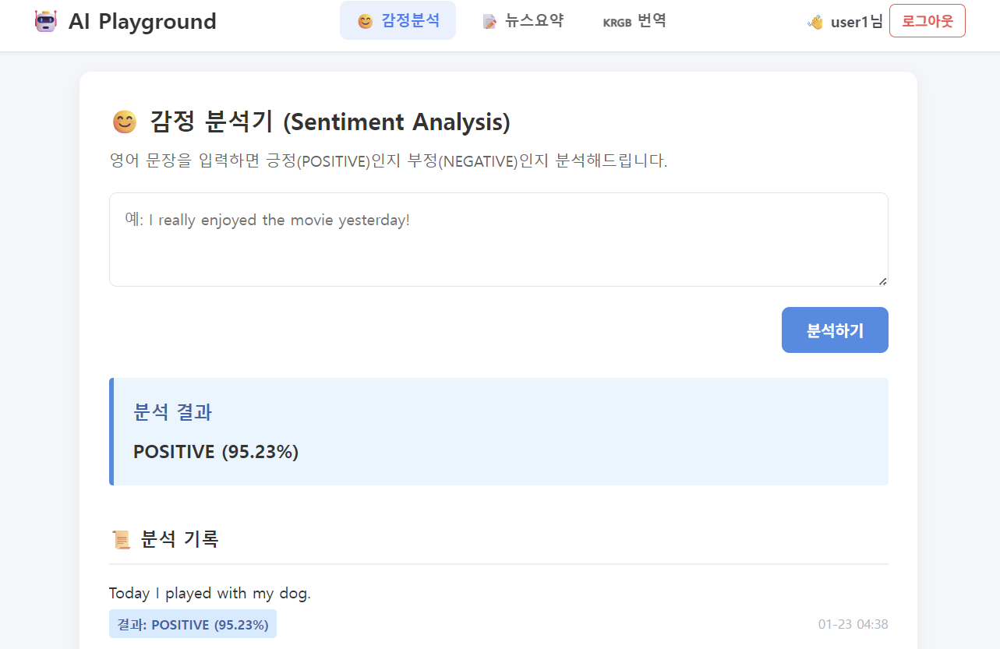
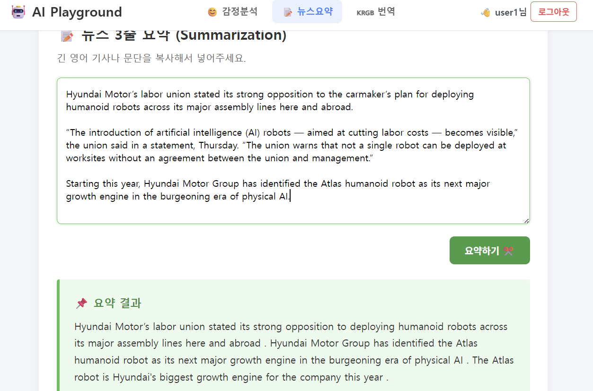
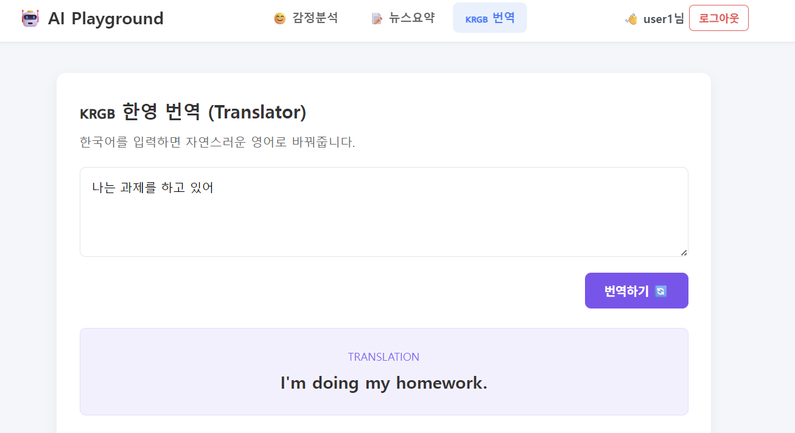

# 🤖 Django AI Playground (Hugging Face Integration)

Django 웹 프레임워크와 Hugging Face Inference API를 연동하여 제작한 AI 웹 서비스입니다.  
사용자는 감정 분석, 뉴스 요약, 한영 번역 기능을 탭 형태로 편리하게 이용할 수 있으며, AJAX 비동기 통신을 적용하여 빠른 사용자 경험을 제공합니다.

## ✨ 주요 기능 (Key Features)

* **3가지 AI 기능 제공:**
    1.  **😊 감정 분석 (Sentiment Analysis):** 영어 문장의 긍정/부정 여부 판단
    2.  **📝 뉴스 요약 (Summarization):** 긴 영어 텍스트를 핵심 내용 3줄로 요약
    3.  **🇰🇷🇬🇧 한영 번역 (Translation):** 한국어 문장을 자연스러운 영어로 번역
* **사용자 권한 관리 (Auth System):**
    * 회원가입/로그인 기능 구현
    * **Public:** 감정 분석은 누구나 사용 가능
    * **Private:** 요약 및 번역은 로그인한 사용자만 접근 가능 (접근 시도 시 로그인 유도)
* **데이터베이스 연동:** 로그인한 사용자의 AI 대화 내역(History) 자동 저장 및 조회
* **UI/UX:** 반응형 디자인, 카드 UI, 현재 탭 강조 기능

---

## 🧠 사용된 AI 모델 (Models)

Hugging Face의 Inference API를 사용하여 서버 부하 없이 고성능 모델을 활용합니다.

| 기능 | 모델명 (Hugging Face ID) | 설명 |
| :--- | :--- | :--- |
| **감정 분석** | `distilbert-base-uncased-finetuned-sst-2-english` | 가볍고 빠른 DistilBERT 기반의 영어 감정 분류 모델 |
| **뉴스 요약** | `sshleifer/distilbart-cnn-12-6` | CNN 뉴스 데이터로 학습된 BART 기반 요약 모델 |
| **한영 번역** | `Helsinki-NLP/opus-mt-ko-en` | MarianMT 기반의 고성능 한국어 → 영어 번역 모델 |

---

## 사용 모델 (3개 이상)


### 1. Helsinki-NLP/opus-mt-ko-en
-**태스크**: Translation (번역)
-**입력 예시** : Today I played with my dog.
-**출력 예시** : 결과: POSITIVE (95.23%)
- 실행 화면 예시:


### 2. sshleifer/distilbart-cnn-12-6
-**태스크**: Summarization (요약)
-**입력 예시** : Hyundai Motor’s labor union stated its strong opposition to the carmaker’s plan for deploying humanoid robots across its major assembly lines here and abroad.

“The introduction of artificial intelligence (AI) robots — aimed at cutting labor costs — becomes visible,” the union said in a statement, Thursday. “The union warns that not a single robot can be deployed at worksites without an agreement between the union and management.”

Starting this year, Hyundai Motor Group has identified the Atlas humanoid robot as its next major growth engine in the burgeoning era of physical AI.
-**출력 예시** : Hyundai Motor’s labor union stated its strong opposition to deploying humanoid robots across its major assembly lines here and abroad . Hyundai Motor Group has identified the Atlas humanoid robot as its next major growth engine in the burgeoning era of physical AI . The Atlas robot is Hyundai's biggest growth engine for the company this year .
- 실행 화면 예시:


### 3. distilbert-base-uncased-finetuned-sst-2-english
-**태스크**: Sentiment Analysis (감정 분석)
-**입력 예시**: 나는 과제를 하고 있어
-**출력 예시**: I'm doing my homework.
- 실행 화면 예시:


---
## 구현 체크리스트

- [O] 탭 3개 이상 + 각 탭 별 URL 분리
- [O] 각 탭: 입력 → 실행 → 결과 출력
- [O] 에러 처리: 모델 호출 실패 시 사용자에게 메시지 표시
- [O] 로딩 표시(최소한 “처리 중…” 텍스트라도)
- [O] 요청 히스토리 5개
- [O]`.env` 사용 (토큰/API Key 노출 금지)
- [O]`README.md`에 모델 정보/사용 예시/실행 방법 작성 후 GitHub push

### 로그인 제한 체크
- [O] 비로그인 사용자는 1개 탭만 접근 가능
- [O] 제한 탭 접근 시 alert 후 로그인 페이지로 redirect
- [O] 로그인 성공 시 원래 페이지로 복귀(next)


---
## 🛠 실행 방법 (Installation & Run)

이 프로젝트는 **Python 3.9+** 환경에서 실행하는 것을 권장합니다.

### 1. 가상환경 설치 및 활성화
```bash
# Windows
python -m venv venv
venv\Scripts\activate

# Mac/Linux
python3 -m venv venv
source venv/bin/activate
```

### 2. 패키지 설치
```bash
pip install -r requirements.txt
```

### 3. 환경 변수 설정 (.env)

프로젝트 루트 경로에 .env 파일을 생성하고 Hugging Face API 키를 입력합니다.
```bash
# .env 파일 예시
HF_API_KEY=hf_xxxxxxxxxxxxxxxxxxxxxxxxxxxxxx
```
### 4. 데이터베이스 마이그레이션
```bash
python manage.py makemigrations
python manage.py migrate
```

### 5. 서버 실행
```bash
python manage.py runserver
```